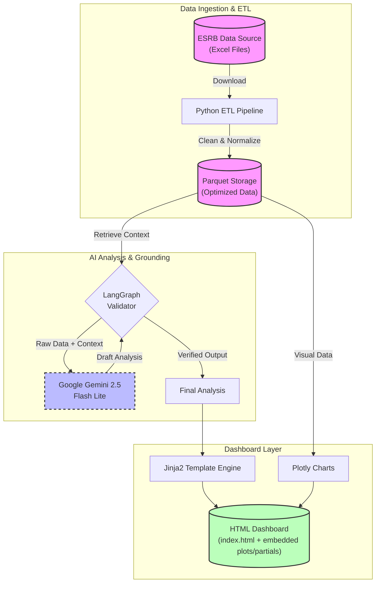

# 🇪🇺 Macro Policy Hub (AI-Powered) 🚀

**An automated, AI-driven dashboard for tracking Macroprudential Policy (CCyB & SyRB) across the European Economic Area.**

This repository hosts a sophisticated pipeline that retrieves raw policy data from the **European Systemic Risk Board (ESRB)**, processes it, and generates a professional, mobile-responsive HTML dashboard. It leverages **Google Gemini 2.5 Flash Lite** to provide executive summaries, strategic insights, and smart keyword extraction from complex legal texts.

---

## 💼 Business Value

Reduces the time required for quarterly macroprudential reporting from days to minutes by automating data retrieval, cleaning, and initial analysis.

## 🌟 Key Features

### 1. Multi-Pillar Monitoring 🏛️

- **Part I: CCyB Monitor:** Tracks Countercyclical Capital Buffer rates, calculating diffusion indices and analyzing the credit gap vs. rate decoupling.
- **Part II: SyRB Monitor:** A dedicated section for the **Systemic Risk Buffer**, distinguishing between **General** and **Sectoral** measures (e.g., Residential/Commercial Real Estate).
- **Part III: BBM Monitor:** Borrower-Based Measures adoption, cross-country active tools matrix, and recent decisions.

### 2. AI-Driven Intelligence (Gemini 2.5 Flash Lite) 🧠

- **Global Executive Summary:** Generates a 4-5 paragraph strategic overview with bold topic sentences for quick scanning.
- **Section Summaries:** Specific high-level summaries for both CCyB and SyRB chapters.
- **Professional Keyword Extraction:** Automatically converts complex legal descriptions into concise, risk-focused tags (e.g., _"Sectoral systemic risk, mortgage loan portfolios"_), filtered to remove technical noise.
- **Sequential Analysis:** High-level summaries are built upon individual chart analyses for maximum context and accuracy.
- **Grounded Validation:** LangGraph-based verification of AI text against data, chart context, and (optional) Google Search sources.

### 3. Modern, Mobile-First UI 📱

- **Left Navigation Sidebar:** Persistent nav with Lucide icons for quick access to each module.
- **News Feed Experience:** Card-based feed with tags, dates (Published/Reported + Retrieval time), source icons, and country pills.
- **Filters & Search:** Instant keyword search and thematic filters for rapid triage.
- **Responsive Design:** Mobile-friendly layout with a collapsible sidebar menu.
- **Interactive Charts:** Zoomable Plotly visualizations (Diffusion Trends, Risk Analysis, Sectoral Focus).
- **Smart Filtering:** Instant JavaScript-based filtering for historical time-series charts.
- **Data Portability:** Integrated download links for processed trend data (Excel).
- **Refactored Output:** `index.html` stays lightweight by embedding charts/tables from `reports/plots` and `reports/partials`.

### 4. Robust ETL Pipeline ⚙️

- **Lifecycle Tracking:** Advanced SyRB trend calculation that accurately handles activation and deactivation/revocation events.
- **Dynamic Parsing:** Resilient to format changes in ESRB Excel files.
- **Data Cleaning:** Normalizes country names (ISO2/ISO3), dates, and rates.

### 5. ETL Flow (Detailed) 🧩

- **Ingestion:** Downloads ESRB CCyB & SyRB Excel sources and refreshes local caches in `data/`.
- **Schema Normalization:** Cleans headers, resolves multi-row headers, and standardizes column names.
- **Country + Date Hygiene:** Harmonizes ISO codes, country labels, and date fields for consistent joins.
- **Measure Parsing:** Extracts numeric rates, exposure types, statuses, and decision/effective dates.
- **Derived Tables:** Builds “latest snapshot” tables, decision extracts, and trend datasets.
- **BBM Matrix:** Maps borrower-based measures to standard short labels and generates a pivot matrix.
- **Outputs:** Writes cleaned parquet datasets plus visualization-ready dataframes.

### 6. LLM Flow (Detailed) 🤖

- **Inputs:** Structured tables (CCyB/SyRB/BBM/News) and chart images where relevant.
- **Chart Analyses:** Per-chart interpretations focused on last-12-month objectives and risks.
- **Section Summaries:** Synthesizes recent trends and policy intent by country group, avoiding tool mechanics.
- **Global Executive Summary:** Integrates section summaries into a multi-paragraph strategic narrative.
- **Text Cleaning:** Converts LLM output to HTML-safe summaries with consistent emphasis.
- **News Enrichment:** Generates 2–3 sentence summaries and assigns policy/theme tags.
- **Optional Grounding:** Validates AI output against data, charts, and optional Google Search context.

---

## 🧭 System Overview (Mermaid)

## 📂 Project Structure

    MacroPolicyHub/
    ├── data/                        # Raw Excel downloads & Processed Parquet files
    ├── figures/                     # Static PNG exports for LLM consumption
    ├── assets/                      # UI assets (styles, scripts, embed styles)
    ├── reports/                     # Generated partials, plots, downloads
    ├── templates/
    │   └── report_template.html     # Jinja2 HTML template
    ├── etl.py                       # Main ETL: Downloads & Cleans CCyB/SyRB data
    ├── visualizer.py                # Generates interactive Plotly components & PNGs
    ├── llm_analysis.py              # AI Logic: Summaries, Professional Keyword Extraction
    ├── grounding_validator.py       # LangGraph validation: data + charts + search grounding
    ├── main.py                      # Main orchestrator script
    ├── config.py                    # Centralized configuration (URLs, Model settings)
    ├── utils.py                     # Helper functions
    ├── requirements.txt             # Python dependencies
    └── README.md                    # Project documentation

---

## 🚀 Installation & Usage

### 1. Prerequisites

- Python 3.10+
- A Google Cloud API Key (for Gemini)
- Optional: Custom Search JSON API key + Programmable Search Engine ID (for grounding)

### 2. Install Dependencies

    pip install -r requirements.txt

_(Key libraries: `pandas`, `plotly`, `langchain-google-genai`, `jinja2`, `openpyxl`, `country_converter`)_

### 3. Configuration

Create a `.env` file in the root directory and add your API key(s):

    GOOGLE_API_KEY=your_actual_api_key_here
    CUSTOM_SEARCH_API_KEY=your_custom_search_api_key
    GOOGLE_CSE_ID=your_custom_search_engine_id
    SEARCH_ALLOWED_DOMAINS=ecb.europa.eu,esrb.europa.eu,bankofgreece.gr
    SEARCH_ENABLED=1

### 4. Run the Pipeline

To generate the static HTML report:

    python main.py

- **Step 1:** Downloads latest Excel files from ESRB.
- **Step 2:** Processes data, identifying active vs. revoked measures.
- **Step 3:** Generates interactive Plotly charts and static PNGs.
- **Step 4:** Sequential AI analysis: Chart Analysis -> Section Summaries -> Global Executive Summary.
- **Step 5:** Optional grounded validation (data + charts + optional external sources).
- **Step 6:** Renders the final `index.html`.

---

## 📊 Dashboard Sections

The generated `index.html` includes:

1.  **Global Executive Summary:** Comprehensive synthesis of the macroprudential stance.
2.  **CCyB Section:**
    - _Section Summary:_ High-level bullet points on cyclical risks.
    - _Adoption Count:_ Cumulative line chart of positive CCyB rates.
    - _Historical Rates:_ Filterable time-series of country-specific rates.
    - _Map & Comparative Views:_ Geographic and bar chart distribution.
    - _Risk Analysis:_ Credit Gap vs. CCyB decoupling.
    - _Latest Decisions:_ Table with AI-generated risk keywords.
3.  **SyRB Section:**
    - _Section Summary:_ Strategic overview of structural buffers.
    - _Adoption Trend:_ Count of countries using General vs. Sectoral SyRB.
    - _Sectoral Focus:_ Composition by exposure type (RRE, CRE, etc.).
    - _Active Measures & Latest Decisions:_ Detailed tables with AI-cleaned descriptions.
4.  **BBM Section:**
    - _Section Summary:_ Overview of borrower-based constraints.
    - _Adoption Count:_ Countries using at least one BBM.
    - _Active Measures Cross-Country Comparison:_ Pivot table of active tools.
    - _LTV Measures:_ Country list, limit ranges, FTB discounts, and exceptions.
    - _Latest Decisions:_ AI-cleaned BBM decisions.
5.  **News Section:**
    - _Highlights Summary:_ AI synthesis of the last 12 months.
    - _News Feed:_ Cards with tags, source icons, dates, and country pills.
    - _Filters:_ Keyword search + policy/theme filters.

---

## License

This project is open-source, licensed under the **Creative Commons Attribution-NonCommercial 4.0 International License (CC BY-NC 4.0)**.
