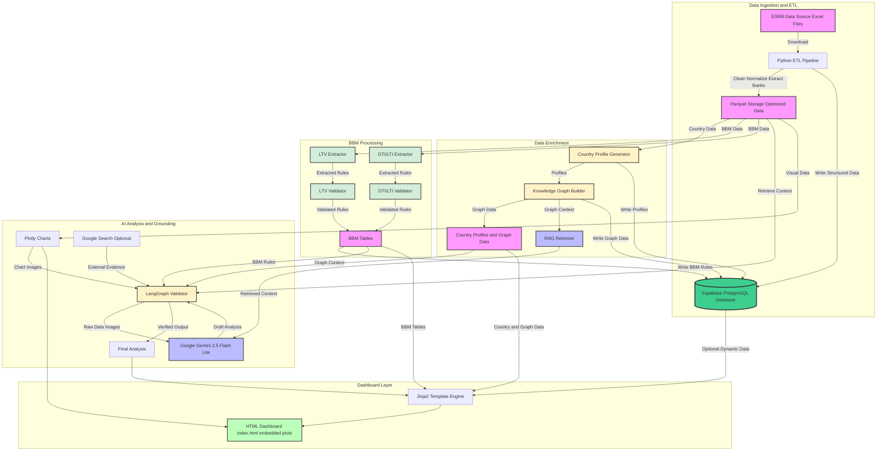

# 🇪🇺 Macro Policy Hub (AI-Powered) 🚀

**An automated, AI-driven dashboard for tracking Macroprudential Policy (CCyB & SyRB) across the European Economic Area.**

This repository hosts a sophisticated pipeline that retrieves raw policy data from the **European Systemic Risk Board (ESRB)**, processes it, and generates a professional, mobile-responsive HTML dashboard. It leverages **Google Gemini 2.5 Flash Lite** to provide executive summaries, strategic insights, and smart keyword extraction from complex legal texts. The system includes **Supabase integration** for optional dynamic data loading and real-time updates.

---

## 💼 Business Value

The Macro Policy Hub delivers significant operational and strategic value for financial institutions, central banks, and regulatory bodies:

### ⏱️ Time Efficiency
- **Quarterly Reporting:** Reduces macroprudential reporting time from **days to minutes** by automating data retrieval, cleaning, and initial analysis
- **Real-Time Monitoring:** Enables continuous tracking of policy changes across 30+ EEA countries without manual data collection
- **Instant Updates:** Supabase integration allows for on-demand data refresh, eliminating the need for full pipeline re-runs

### 🎯 Accuracy & Consistency
- **AI-Validated Data:** Automated validation using Google Gemini 2.5 Flash Lite ensures data accuracy and consistency across all measures
- **Expert Corrections:** Built-in expert knowledge base for country-specific policy nuances (e.g., SK's age-decreasing DTI limits, IE's FTB vs. standard limits)
- **Structured Extraction:** Regex + AI-powered extraction of LTV and DTI/LTI rules reduces human error in data interpretation

### 💰 Cost Reduction
- **Reduced Manual Labor:** Eliminates hours of manual data entry, Excel manipulation, and cross-referencing across multiple ESRB sources
- **Scalable Solution:** Handles increasing data volumes (new countries, measures, historical data) without proportional cost increases
- **Maintenance Efficiency:** Automated pipeline reduces ongoing maintenance compared to manual reporting processes

### 📊 Strategic Insights
- **Executive Summaries:** AI-generated strategic overviews enable quick decision-making for senior management
- **Cross-Country Comparison:** Instant comparison of policy measures across EEA countries for benchmarking and best practices
- **Trend Analysis:** Historical evolution tracking helps identify policy patterns and anticipate future changes
- **Knowledge Graph Analysis:** AI-powered relationship mapping reveals policy clusters and regional similarities

### 🔄 Operational Excellence
- **Standardized Output:** Consistent reporting format across all countries and measures ensures comparability
- **Multi-Pillar Monitoring:** Unified dashboard for CCyB, SyRB, BBM, and OSII/GSII measures in one place
- **Mobile Accessibility:** Responsive design enables access from any device, supporting remote work and field operations
- **Data Portability:** Excel exports and structured data formats (Parquet, Supabase) enable further analysis in specialized tools

## 🌟 Key Features

### 1. Multi-Pillar Monitoring 🏛️

- **Part I: CCyB Monitor:** Tracks Countercyclical Capital Buffer rates, calculating diffusion indices and analyzing the credit gap vs. rate decoupling.
- **Part II: SyRB Monitor:** A dedicated section for the **Systemic Risk Buffer**, distinguishing between **General** and **Sectoral** measures (e.g., Residential/Commercial Real Estate).
- **Part III: BBM Monitor:** Borrower-Based Measures adoption, cross-country active tools matrix, structured LTV comparison table (with AI verification), DTI/LTI comparison table (with AI verification and expert corrections, supporting multiple limits/ranges), and recent decisions.
- **Part IV: Country Profiles:** Interactive country-specific pages with institutional setup of macroprudential policy (NMA, NDA, legal basis, AI-generated descriptions with confidence scores), current status, historical evolution, recent changes, active measures, and peer comparison.
- **Part V: Knowledge Graph Analysis:** AI-powered analysis of policy relationships and patterns, comparing graph-derived insights with table-based data for validation and pattern identification.

### 2. AI-Driven Intelligence (Gemini 2.5 Flash Lite) 🧠

- **Global Executive Summary:** Generates a 4-5 paragraph strategic overview with bold topic sentences for quick scanning.
- **Section Summaries:** Specific high-level summaries for both CCyB and SyRB chapters.
- **Professional Keyword Extraction:** Automatically converts complex legal descriptions into concise, risk-focused tags (e.g., _"Sectoral systemic risk, mortgage loan portfolios"_), filtered to remove technical noise.
- **Sequential Analysis:** High-level summaries are built upon individual chart analyses for maximum context and accuracy.
- **Grounded Validation:** LangGraph-based verification of AI text against data, chart context, knowledge graph relationships, and (optional) Google Search sources.
- **Knowledge Graph Analysis:** AI analysis of policy relationships, comparing graph structure with table data to identify patterns, validate consistency, and highlight policy clusters.

**Applied Grounding Methods**

The system uses several techniques to keep AI output factual and traceable:

| Method | Where Used | Description |
|--------|------------|-------------|
| **Confidence score** | Institutional Setup (Country Profiles) | Numeric 0–1 scale (1.0 = fully grounded in structured data, 0.5 = partial inference, 0.0 = no data). Shown as a badge (high/medium/low) next to AI descriptions. |
| **Grounding notes** | Institutional Setup | Short explanation of which facts and sources the description is based on. |
| **Sources cited** | Institutional Setup, BBM validation | List of references (e.g. ESRB NMA list, national central bank, legal basis). Displayed below the AI text. |
| **Evidence excerpt** | LTV & DTI/LTI extraction | Exact quote from the ESRB description that justifies each extracted limit. Used to avoid hallucination. |
| **Confidence (high/medium/low)** | BBM rules (LTV, DTI/LTI) | Per-rule confidence from the validator. Only high-confidence rules are shown by default. |
| **Claim verification** | Executive summaries, section summaries | Extracted claims are checked against data tables and chart context; verdicts: supported / contradicted / unclear. |
| **External search & citation** | Optional (when `RUN_GROUNDING=1`) | For contradicted or unclear claims, Google Custom Search on allowed domains (e.g. ecb.europa.eu, esrb.europa.eu). Revised text may include inline citations in the form `(Source: URL)`. |
| **Knowledge graph grounding** | Global summaries | Graph statistics (country counts, measure counts, relationships) are included in the validation context so claims stay consistent with the structured graph. |

### 3. Supabase Integration 🗄️

- **Optional Dynamic Data Loading:** Frontend can fetch data from Supabase REST API for real-time updates.
- **Structured Data Storage:** PostgreSQL-based storage for CCyB, SyRB, BBM, LTV, DTI/LTI rules, institutional setup, and country profiles.
- **On-Demand Data Fetching:** Country profiles and BBM rules can be loaded dynamically from Supabase when enabled.
- **Fallback Support:** Gracefully falls back to static embedded data if Supabase is unavailable.

### 4. Modern, Mobile-First UI 📱

- **Left Navigation Sidebar:** Persistent nav with Lucide icons for quick access to each module.
- **News Feed Experience:** Card-based feed with tags, dates (Published/Reported + Retrieval time), source icons, and country pills.
- **Filters & Search:** Instant keyword search and thematic filters for rapid triage.
- **Responsive Design:** Mobile-friendly layout with a collapsible sidebar menu.
- **Interactive Charts:** Zoomable Plotly visualizations (Diffusion Trends, Risk Analysis, Sectoral Focus).
- **Smart Filtering:** Instant JavaScript-based filtering for historical time-series charts.
- **Data Portability:** Integrated download links for processed trend data (Excel).
- **Country Profiles:** Dynamic country-specific pages with comprehensive macroprudential policy overview.
- **Knowledge Graph Analysis:** AI-driven insights from policy relationship graphs, used for enhanced analysis and validation.
- **Dynamic Page Titles:** Page title updates based on active section for better browser navigation.
- **Refactored Output:** `index.html` stays lightweight by embedding charts/tables from `reports/plots` and `reports/partials`.

### 5. Robust ETL Pipeline ⚙️

- **Lifecycle Tracking:** Advanced SyRB trend calculation that accurately handles activation and deactivation/revocation events.
- **Dynamic Parsing:** Resilient to format changes in ESRB Excel files.
- **Data Cleaning:** Normalizes country names (ISO2/ISO3), dates, and rates.

### 6. ETL Flow (Detailed) 🧩

- **Ingestion:** Downloads ESRB CCyB & SyRB Excel sources and refreshes local caches in `data/`.
- **Schema Normalization:** Cleans headers, resolves multi-row headers, and standardizes column names.
- **Country + Date Hygiene:** Harmonizes ISO codes, country labels, and date fields for consistent joins.
- **Measure Parsing:** Extracts numeric rates, exposure types, statuses, and decision/effective dates.
- **Derived Tables:** Builds "latest snapshot" tables, decision extracts, and trend datasets.
- **BBM Matrix:** Maps borrower-based measures to standard short labels and generates a pivot matrix.
- **Structured BBM Extraction:** Extracts structured LTV and DTI/LTI rules using regex and AI, supporting multiple limits/ranges (e.g., "3.0x, 8.0x" for SK) with explanatory notes.
- **Supabase Integration:** Optional data persistence to PostgreSQL (via Supabase) for structured storage, REST API access, and dynamic frontend data loading.
- **Outputs:** Writes cleaned parquet datasets plus visualization-ready dataframes, optionally syncs to Supabase.

### 7. LLM Flow (Detailed) 🤖

- **Inputs:** Structured tables (CCyB/SyRB/BBM/News), knowledge graph relationships, and chart images where relevant.
- **Chart Analyses:** Per-chart interpretations focused on last-12-month objectives and risks.
- **Section Summaries:** Synthesizes recent trends and policy intent by country group, avoiding tool mechanics.
- **Global Executive Summary:** Integrates section summaries into a multi-paragraph strategic narrative.
- **BBM Rule Extraction & Validation:** AI-powered extraction and validation of LTV and DTI/LTI rules from ESRB descriptions, with support for multiple limits/ranges and expert corrections.
- **Knowledge Graph Analysis:** AI analysis comparing graph structure with table data to identify patterns and validate consistency.
- **Text Cleaning:** Converts LLM output to HTML-safe summaries with consistent emphasis.
- **News Enrichment:** Generates 2–3 sentence summaries and assigns policy/theme tags.
- **Optional Grounding:** Multimodal validation against data tables, chart images, and knowledge graph relationships; optional Google Search for contradicted/unclear claims with inline citations. See _Applied Grounding Methods_ above.

---

## 🧭 System Overview (Mermaid)


```mermaid
graph TD
    subgraph DataIngestion[Data Ingestion and ETL]
        A[ESRB Data Source Excel Files] -->|Download| B[Python ETL Pipeline]
        B -->|Clean Normalize Extract Banks| C[Parquet Storage Optimized Data]
        B -->|Write Structured Data| DB[(Supabase PostgreSQL Database)]
    end

    subgraph DataEnrichment[Data Enrichment]
        C -->|Country Data| K[Country Profile Generator]
        K -->|Profiles| L[Knowledge Graph Builder]
        L -->|Graph Data| M[Country Profiles and Graph Data]
        L -->|Graph Context| N[RAG Retriever]
        K -->|Write Profiles| DB
        L -->|Write Graph Data| DB
    end

    subgraph BBMProcessing[BBM Processing]
        C -->|BBM Data| O[LTV Extractor]
        C -->|BBM Data| P[DTI/LTI Extractor]
        O -->|Extracted Rules| Q[LTV Validator]
        P -->|Extracted Rules| R[DTI/LTI Validator]
        Q -->|Validated Rules| S[BBM Tables]
        R -->|Validated Rules| S
        S -->|Write BBM Rules| DB
    end

    subgraph AICore[AI Analysis and Grounding]
        C -->|Retrieve Context| D[LangGraph Validator]
        H[Plotly Charts] -->|Chart Images| D
        J[Google Search Optional] -->|External Evidence| D
        M -->|Graph Context| D
        N -->|Retrieved Context| E[Google Gemini 2.5 Flash Lite]
        S -->|BBM Rules| D
        D -->|Raw Data Images| E
        E -->|Draft Analysis| D
        D -->|Verified Output| F[Final Analysis]
    end

    subgraph Presentation[Dashboard Layer]
        F --> G[Jinja2 Template Engine]
        C -->|Visual Data| H
        M -->|Country and Graph Data| G
        S -->|BBM Tables| G
        DB -->|Optional Dynamic Data| G
        G --> I[HTML Dashboard index.html embedded plots]
        H --> I
    end

    style A fill:#f9f,stroke:#333,stroke-width:2px
    style C fill:#f9f,stroke:#333,stroke-width:2px
    style DB fill:#3ecf8e,stroke:#333,stroke-width:3px
    style E fill:#bbf,stroke:#333,stroke-width:2px
    style D fill:#fef3c7,stroke:#333,stroke-width:2px
    style K fill:#fef3c7,stroke:#333,stroke-width:2px
    style L fill:#fef3c7,stroke:#333,stroke-width:2px
    style M fill:#f9f,stroke:#333,stroke-width:2px
    style N fill:#bbf,stroke:#333,stroke-width:2px
    style O fill:#d4edda,stroke:#333,stroke-width:2px
    style P fill:#d4edda,stroke:#333,stroke-width:2px
    style Q fill:#d4edda,stroke:#333,stroke-width:2px
    style R fill:#d4edda,stroke:#333,stroke-width:2px
    style S fill:#f9f,stroke:#333,stroke-width:2px
    style I fill:#bfb,stroke:#333,stroke-width:2px
```

## 📂 Project Structure

    MacroPolicyHub/
    ├── data/                        # Raw Excel downloads & Processed Parquet files
    ├── figures/                     # Static PNG exports for LLM consumption
    ├── assets/                      # UI assets (styles, scripts, embed styles)
    ├── reports/                     # Generated partials, plots, downloads
    ├── templates/
    │   └── report_template.html     # Jinja2 HTML template
    ├── pipeline/                    # Stage-based pipeline architecture
    │   ├── orchestrator.py          # Main pipeline orchestrator
    │   └── stages/                  # Pipeline stages
    │       ├── data_stage.py        # ETL stage
    │       ├── visualization_stage.py # Visualization stage
    │       ├── ai_stage.py          # AI analysis stage
    │       ├── bbm_stage.py         # BBM processing stage
    │       ├── profile_stage.py     # Country profiles stage
    │       └── render_stage.py      # Rendering stage
    ├── bbm/                         # Borrower-Based Measures modules
    │   ├── ltv_model.py            # LTV data model
    │   ├── ltv_extractor.py        # LTV extraction (regex + AI)
    │   ├── ltv_validator.py        # LTV AI validation
    │   ├── ltv_builder.py          # LTV table builder
    │   ├── ltv_renderer.py         # LTV HTML renderer
    │   ├── dti_lti_model.py        # DTI/LTI data model
    │   ├── dti_lti_extractor.py    # DTI/LTI extraction
    │   ├── dti_lti_validator.py   # DTI/LTI AI validation
    │   ├── dti_lti_builder.py     # DTI/LTI table builder
    │   └── dti_lti_renderer.py    # DTI/LTI HTML renderer
    ├── etl.py                       # Main ETL: Downloads & Cleans CCyB/SyRB data
    ├── visualizer.py                # Generates interactive Plotly components & PNGs
    ├── llm_analysis.py              # AI Logic: Summaries, Keyword Extraction, BBM Rule Extraction & Validation
    ├── grounding_validator.py       # LangGraph validation: data + charts + graph relationships + search grounding
    ├── country_profiles.py          # Country profile generation and knowledge graph data builder
    ├── main.py                      # Main entry point (uses PipelineOrchestrator)
    ├── config.py                    # Centralized configuration (URLs, Model settings)
    ├── utils.py                     # Helper functions
    ├── requirements.txt             # Python dependencies
    ├── Dockerfile                   # Docker image for pipeline
    ├── docker-compose.yml           # Local Docker run
    └── README.md                    # Project documentation

---

## 🚀 Installation & Usage

### 1. Prerequisites

- Python 3.10+
- A Google Cloud API Key (for Gemini)
- Optional: Custom Search JSON API key + Programmable Search Engine ID (for grounding)

### 2. Install Dependencies

    pip install -r requirements.txt

_(Key libraries: `pandas`, `plotly`, `langchain-google-genai`, `jinja2`, `openpyxl`, `country_converter`, `supabase`)_

### 3. Configuration

Create a `.env` file in the root directory and add your API key(s):

    GOOGLE_API_KEY=your_actual_api_key_here
    CUSTOM_SEARCH_API_KEY=your_custom_search_api_key
    GOOGLE_CSE_ID=your_custom_search_engine_id
    SEARCH_ALLOWED_DOMAINS=ecb.europa.eu,esrb.europa.eu,bankofgreece.gr
    SEARCH_ENABLED=1
    
    # Optional: Supabase integration
    SUPABASE_URL=https://your-project.supabase.co
    SUPABASE_KEY=your_anon_key_here
    SUPABASE_SERVICE_KEY=your_service_role_key_here
    USE_SUPABASE_FOR_RENDER=false  # Set to true to use Supabase for render stage
    ENABLE_SUPABASE=false  # Set to true to enable Supabase data writing
    RUN_GROUNDING=false  # Set to true to enable claim verification + external search (extra token cost)

### 4. Run the Pipeline

To generate the static HTML report:

    python main.py

- **Step 1:** Downloads latest Excel files from ESRB.
- **Step 2:** Processes data, identifying active vs. revoked measures.
- **Step 3:** Generates interactive Plotly charts and static PNGs.
- **Step 4:** Sequential AI analysis: Chart Analysis -> Section Summaries -> Global Executive Summary.
- **Step 5:** Optional grounded validation if `RUN_GROUNDING=true` (off by default).
- **Step 6:** Optional Supabase data writing (if `ENABLE_SUPABASE=true`).
- **Step 7:** Renders the final `index.html` (optionally using Supabase data if `USE_SUPABASE_FOR_RENDER=true`).

### 5. Run with Docker (optional)

For a reproducible environment without installing Python locally:

**Using Docker directly:**

    docker build -t macroprudential-hub .
    docker run --rm -e GOOGLE_API_KEY=your_key -v "$(pwd)":/app macroprudential-hub

**Using Docker Compose:**

    docker-compose run --rm pipeline

Output (`index.html`, `reports/`, `figures/`, `data/`) is written to the current directory. Ensure `.env` exists with your API keys when using docker-compose.

### 6. Automated Build & Deployment (GitHub Actions)

This repository uses **GitHub Actions** to build and deploy the dashboard:

- **Manual trigger:** Actions → **Build Dashboard** → **Run workflow**
- **Scheduled:** 1st of every month at 06:00 UTC

**The workflow:**
1. Builds the Docker image
2. Runs the pipeline inside the container (ETL, AI analysis, country profiles)
3. Commits and pushes the generated `index.html`, `reports/`, and `figures/`

**Required secrets** (Settings → Secrets and variables → Actions):

| Secret | Description |
|--------|-------------|
| `GOOGLE_API_KEY` | Google AI (Gemini) API key |
| `SUPABASE_URL` | Supabase project URL |
| `SUPABASE_KEY` | Supabase anon/public key |
| `SUPABASE_SERVICE_KEY` | Supabase service_role key |
| `ENABLE_SUPABASE` | `true` to write pipeline data to Supabase |
| `USE_SUPABASE_FOR_RENDER` | `true` to use Supabase data in the report |

**Optional secrets** (for grounding/external search):
- `CUSTOM_SEARCH_API_KEY`, `GOOGLE_CSE_ID`, `SEARCH_ENABLED`

**Batch-set secrets from `.env` (PowerShell):**
```powershell
$secrets = @("GOOGLE_API_KEY","SUPABASE_URL","SUPABASE_KEY","SUPABASE_SERVICE_KEY","ENABLE_SUPABASE","USE_SUPABASE_FOR_RENDER")
foreach ($name in $secrets) {
  $line = Get-Content .env | Select-String "^$name=" | Select-Object -First 1
  if ($line) { $val = ($line -replace "^$name=","").Trim(); gh secret set $name --body $val }
}
```

**Manual Publish (Alternative):**

If you prefer manual publishing:

    python main.py
    # or: docker run --rm -e GOOGLE_API_KEY=xxx -v "$(pwd)":/app macroprudential-hub
    git add index.html assets/ reports/ CNAME
    git commit -m "Publish dashboard YYYY-MM-DD"
    git push

---

## 📊 Dashboard Sections

The generated `index.html` includes:

1.  **Global Executive Summary:** Comprehensive synthesis of the macroprudential stance.
2.  **CCyB Section:**
    - _Section Summary:_ High-level bullet points on cyclical risks.
    - _Adoption Count:_ Cumulative line chart of positive CCyB rates.
    - _Historical Rates:_ Filterable time-series of country-specific rates.
    - _Map & Comparative Views:_ Geographic and bar chart distribution.
    - _Risk Analysis:_ Credit Gap vs. CCyB decoupling.
    - _Latest Decisions:_ Table with AI-generated risk keywords.
3.  **SyRB Section:**
    - _Section Summary:_ Strategic overview of structural buffers.
    - _Adoption Trend:_ Count of countries using General vs. Sectoral SyRB.
    - _Sectoral Focus:_ Composition by exposure type (RRE, CRE, etc.).
    - _Active Measures & Latest Decisions:_ Detailed tables with AI-cleaned descriptions.
4.  **BBM Section:**
    - _Section Summary:_ Overview of borrower-based constraints.
    - _Adoption Count:_ Countries using at least one BBM.
    - _Active Measures Cross-Country Comparison:_ Pivot table of active tools.
    - _LTV Measures:_ Structured comparison table of Loan-to-Value limits across EU/EEA countries, including standard limits, FTB/BTL limits, exception quotas, legal form, implementation status, and explanatory notes. Supports multiple limits per country (e.g., "80%, 90%") with notes explaining each value. AI-verified with external search validation.
    - _DTI/LTI Measures:_ Comprehensive comparison table of Debt-to-Income and Loan-to-Income limits across EU/EEA countries, including standard limits (supporting ranges like "3.0x, 8.0x"), FTB/BTL limits, green limits, income basis, allowances, and regulation links. AI-verified with expert corrections. Notes column explains multiple limit meanings (e.g., "Decreasing by age" for SK's 3-8x range).
    - _Latest Decisions:_ AI-cleaned BBM decisions.
5.  **Country Profiles:**
    - _Institutional Setup:_ Macroprudential authority (NMA), designated authority (NDA), legal basis, and AI-generated descriptions with confidence scores for 30 EEA countries.
    - _Current Status:_ Snapshot of active measures (CCyB, SyRB, O-SII, BBM) and total capital buffer.
    - _Historical Evolution:_ Time-series trends for CCyB and SyRB rates.
    - _Recent Changes:_ Last 12 months of policy changes and activations.
    - _Active Measures Details:_ Comprehensive breakdown of each active measure.
    - _Comparison with Peers:_ Regional averages and similar countries by capital buffer level.
6.  **Knowledge Graph Analysis:**
    - _AI-Powered Insights:_ Analysis of policy relationships and patterns derived from knowledge graph structure.
    - _Data Validation:_ Comparison of graph statistics with table-based counts to ensure consistency.
    - _Pattern Identification:_ Highlights policy mix patterns, regional similarities, and measure adoption trends.
    - _Grounding Integration:_ Graph data used to enhance AI validation and provide additional context for analysis.
7.  **News Section:**
    - _Highlights Summary:_ AI synthesis of the last 12 months.
    - _News Feed:_ Cards with tags, source icons, dates, and country pills.
    - _Filters:_ Keyword search + policy/theme filters.

---

## License

This project is open-source, licensed under the **Creative Commons Attribution-NonCommercial 4.0 International License (CC BY-NC 4.0)**.
