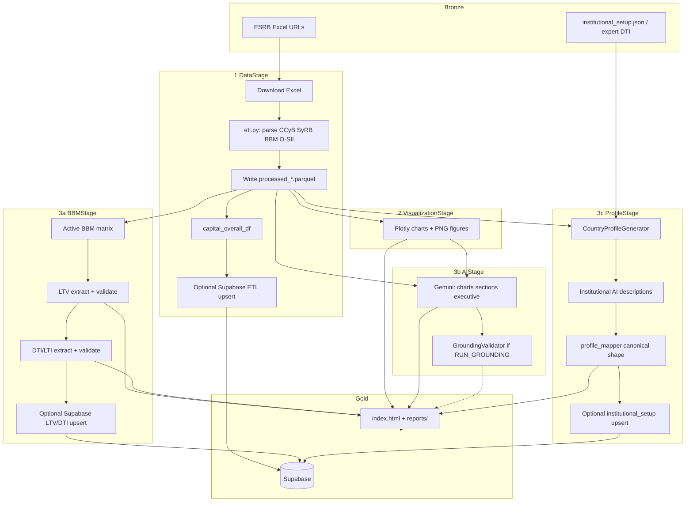
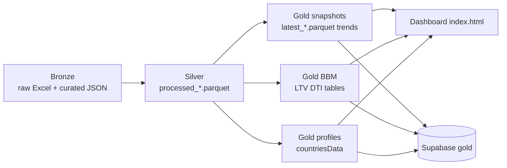

# Medallion layout and pipeline DAG

This document maps the **existing** pipeline to a medallion (bronze / silver / gold) layout and shows the stages **as they run today** (`PipelineOrchestrator`). Paths are not moved yet: files stay under `data/`, `reports/`, and `index.html`. The table below is the contract for any later folder split (`data/bronze`, `data/silver`, `data/gold`).

## Layers

| Layer | Meaning here | Mutability |
|-------|----------------|------------|
| **Bronze** | Source files as received (ESRB Excel, curated JSON/CSV). Do not edit in place. | Overwrite only by re-download or explicit curator update |
| **Silver** | Cleaned, typed, country-normalized tables (parquet). One row grain per measure/event. | Regenerated every ETL run |
| **Gold** | Products for the dashboard and optional Supabase: snapshots, trends, structured BBM, country profiles, HTML | Regenerated every full pipeline run |

LLM text and Plotly HTML are **gold products**, not a fourth lake layer.

## Current files → layer

### Bronze (raw / curated sources)

| Artifact | Location | Produced by |
|----------|----------|-------------|
| CCyB Excel | `data/esrb.ccybd_CCyB_data.xlsx` | `DataStage` / `ETLPipeline` download |
| Measures overview Excel (SyRB, BBM, O-SII, reciprocation) | `data/esrb.measures_overview_macroprudential_measures.xlsx` | same |
| Capital-based measures Excel | `data/esrb.measures_overview_capital-based_measures.xlsx` | same (optional URL) |
| Institutional setup seed | `data/institutional_setup.json` | Curated; not from ESRB Excel |
| Expert DTI table | `data/BBM táblázatok.xlsx` / `data/dti_expert_table.csv` | Curated |

### Silver (cleaned history)

| Artifact | Location | Grain |
|----------|----------|--------|
| CCyB history | `data/processed_ccyb.parquet` | country × date / decision |
| SyRB history | `data/processed_syrb.parquet` | country × measure × date |
| BBM history | `data/processed_bbm.parquet` | country × measure × date |
| O-SII / G-SIB banks | `data/processed_osii.parquet` | country × bank |
| In-memory trends | `agg_trend_df`, `syrb_trend_df`, `bbm_trend_df` (not always written to disk) | date |

### Gold (dashboard and API)

| Artifact | Location |
|----------|----------|
| Latest snapshots | `data/latest_ccyb.parquet`, `latest_syrb.parquet`, `latest_bbm.parquet`, `latest_osii.parquet` |
| Structured LTV / DTI | `data/dti_lti_rules.csv`, LTV/DTI tables in `reports/partials/` |
| Country profiles | Embedded in `index.html` as `window.countriesData`; optional `institutional_setup` in Supabase |
| Charts / tables / Excel | `reports/plots/`, `reports/partials/`, `reports/downloads/` |
| Chart PNGs for LLM | `figures/` |
| Published dashboard | `index.html` |
| Optional warehouse | Supabase tables + `mv_latest_*` / `mv_*_trend` materialized views |

**Proposed physical layout** (not applied): `data/bronze/`, `data/silver/`, `data/gold/` with the same filenames. `config.py` `FILES` would then point at those folders.

## Pipeline stages (as executed)

Matches `pipeline/orchestrator.py`. Knowledge-graph build and `RUN_GROUNDING` are **off** unless explicitly enabled.

## Medallion data flow

## Stage → layer

| Stage | Reads | Writes |
|-------|--------|--------|
| **DataStage** | Bronze Excel | Silver parquet, gold `latest_*`, optional Supabase facts |
| **VisualizationStage** | Silver + gold snapshots | Gold plots (`reports/plots`, `figures/`) |
| **BBMStage** | Silver BBM | Gold LTV/DTI HTML/CSV, optional Supabase rules |
| **AIStage** | Gold tables + figure PNGs | Gold analysis strings (in memory → template) |
| **ProfileStage** | Silver + bronze JSON + gold capital | Gold `countriesData` + institutional AI |
| **RenderStage** | All gold inputs; optional Supabase read merged via `merge_profiles` | `index.html`, `reports/` |

## Rules of thumb

1. **Never hand-edit silver parquet.** Fix bronze (or the parser) and re-run ETL.
2. **Curated overrides** (expert DTI, institutional JSON) live in bronze and are applied when building gold.
3. **Supabase is a gold replica**, not bronze. MVs (`mv_latest_*`) are gold views over silver-like fact tables.
4. **Skip LLM** when bronze file hashes are unchanged (future cost control); still refresh gold HTML if needed.
5. **Canonical country profile** is `country_profiles/profile_mapper.py` — one shape for pipeline, Supabase render, and the frontend.
